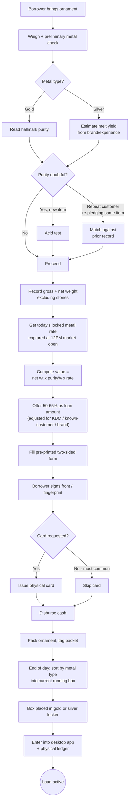
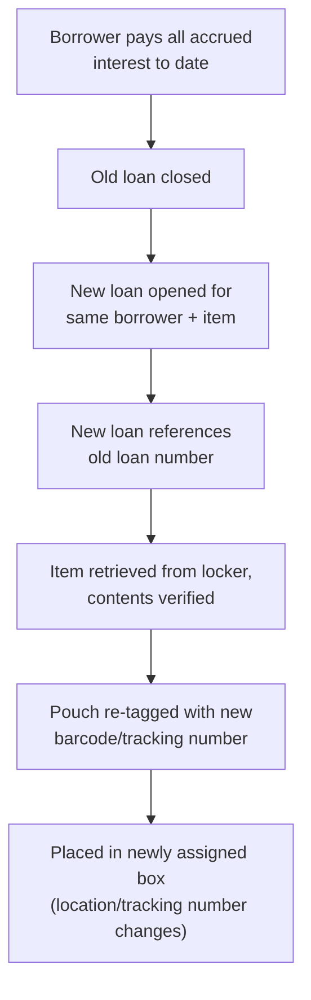
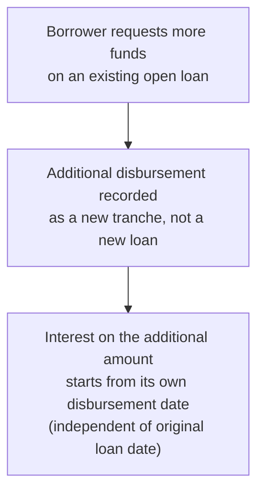
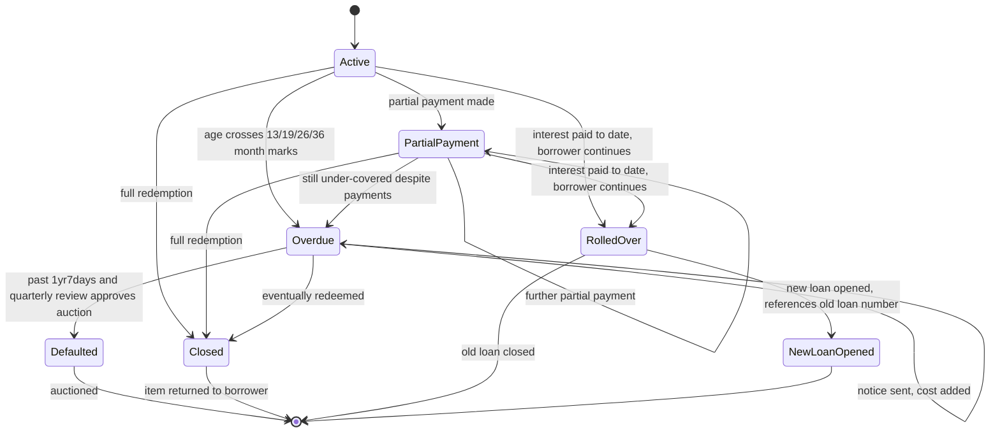
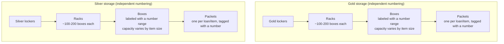

# Business Process: Jewelry Lending (Haripriya Jewels)

This document describes how the physical jewelry-lending business actually
operates today — captured from a stakeholder interview. It is a description
of the real-world process only; it does not reference or compare against any
software.

## 1. Customer base and context

Most borrowers are **farmers**. Their ability to repay tracks **crop
cycles** — e.g. paddy has roughly a 90-day growth cycle, so a borrower might
pledge an item, harvest and sell their crop, then redeem the loan with the
proceeds and often immediately re-pledge for fresh capital. Yield and price
swings mean repayment timing is inherently uncertain: a bad harvest or poor
margins can delay redemption, and borrowers sometimes deliberately hold off
redeeming while waiting for a government agricultural subsidy to arrive,
paying off the loan once the subsidy is disbursed. This uncertainty is the
reason the business does not impose a fixed due date on loans (see Section
5).

## Process overview (at a glance)

## 2. Intake and appraisal

1. A borrower brings an ornament to the shop.
2. Staff weigh the item and perform a preliminary check to confirm the metal
   is what it appears to be.
3. **Purity determination:**
   - **Gold**: read from the hallmark (e.g. 22K = 91.6% pure).
   - **Silver**: hallmarks are unreliable, so purity is estimated from the
     appraiser's experience with the item type and brand/company — e.g. a
     *pattilu* from BSP company yields a higher pure-silver percentage than
     one from KSV, purely from known melt-yield patterns. This knowledge
     currently lives entirely in the appraiser's head; a quick-reference
     lookup would help but must remain editable, since real items vary
     (e.g. accumulated dust adds weight that has to be judged by eye and
     discounted, not just looked up).
   - If purity is doubtful, an **acid test** is performed. Exception: for a
     **repeat customer re-pledging the same item** they previously redeemed,
     the acid test is often skipped — instead the item is matched against
     its prior record (weight and description) to confirm it's the same
     piece.
4. If the item has stones, both **gross weight** (with stones) and **net
   weight** (metal only, stones excluded) are recorded. Only the net weight
   is used for valuation.
5. All staff are cross-trained to do appraisal — there's no fixed
   role split (e.g. one person always appraises, another always handles
   cash). If a staff member is unsure, they escalate to the business owner,
   who also appraises directly.

## 3. Valuation and loan offer

1. The **daily metal rate** comes from bullion apps and WhatsApp groups that
   circulate live rates. The market opens at **12:00 PM IST**; the rate is
   captured once at open and **locked for the rest of that day** — the next
   day gets a fresh rate.
2. Intrinsic value is computed as: net weight × purity % = pure metal
   weight; pure metal weight × that day's rate = item value.
   - Example: a 10g ring, 22K (91.6% pure), rate ₹1000/g → 9.16g pure →
     value ₹9,160.
3. The **loan amount offered is 50–65%** of that computed value — this
   margin protects the business on default (recoverable via the metal's
   melt value) and absorbs future rate volatility.
4. The exact percentage within that range is a judgment call, adjusted by
   real factors:
   - **KDM gold** attracts a higher percentage than plain hallmarked gold.
   - **Known/repeat customers** get a more favorable percentage.
   - For silver, the **brand/company** of the item affects the percentage
     (better-yielding brands get more).

## 4. Loan documentation

1. Terms are captured on a **pre-printed, two-sided paper form**, filled in
   by hand by staff (not generated per-loan by any system).
2. Fields captured: borrower name, C/O, date, loan amount, village, address,
   Aadhar number (if available), phone number, item type, metal type, gross
   weight, net weight, and a free-text description of the item's condition
   (e.g. broken links, missing pieces, general appearance).
3. Only the **Aadhar number** is recorded as text today — no physical or
   photo copy of the ID is kept (though the business would like to start
   keeping an optional copy in the future).
4. **No photographs** of the item are taken today — the written description
   is the only visual record. Photography is something the business wants
   to add eventually, pending a decision on where to store images
   (needs to be accessible and low/no cost).
5. The borrower **signs the front side** of the form (or gives a fingerprint
   if unable to sign) at the time the loan is issued. The form's back side
   carries the printed legal terms/rules and is signed separately at
   redemption (see Section 8).
6. **A single loan can cover multiple pledged ornaments** under one loan
   amount and one document — it is not strictly one item per loan.
7. **Cards (optional physical token)**: at loan issuance, staff can
   optionally issue a physical card recording the borrower's name, loan
   number, loan date, and the shop's address and stamp. If issued, the card
   becomes **legally required** for redemption: the borrower must physically
   present and sign it back at release before the item can be handed over.
   Losing the card triggers a real legal process (affidavit, signed
   document, registration). Because of this hassle, **most borrowers
   decline the card** — only a minority opt to take one.

## 5. No fixed due date

There is no due date or fixed tenure in real operations, and the loan
percentage/interest rate does not change based on any agreed tenure. This is
deliberate, given the crop-cycle-driven, unpredictable repayment behavior
described in Section 1. The business would like a **soft, non-binding due
date** captured purely for admin reference in the future — explicitly not
meant to enforce anything or affect pricing.

## 6. Interest calculation

1. **Tiers** (admin-configurable):
   - Loan amount **≥ ₹1000** → **24% per year** (2% per month).
   - Loan amount **< ₹1000** → **36% per year** (3% per month).
2. **Elapsed time is calculated on true calendar years/months/days**, not a
   fixed day-count convention. E.g. a loan from Jan 17 to Jul 17 is exactly
   "6 months," regardless of which actual calendar months (28/30/31 days)
   fall in between — months are actual calendar months, not fixed 30-day
   blocks.
3. **Minimum charge**: if a loan is redeemed less than 30 days after being
   taken, interest is still charged for a **full month**, not a prorated
   number of days.
4. **Compounding is annual, not monthly or continuous**:
   - Within the first year, interest accrues without compounding.
   - From day 366 onward, the prior year's interest is folded into the
     principal, and subsequent interest is calculated on that new, larger
     balance (e.g. ₹1000 at 24% becomes ₹1240 after year 1; year 2's
     interest is computed on ₹1240). This annual compounding repeats every
     year the loan stays open (year 2, 3, 4, ...).
   - There is an informal **grace window of roughly 7 days right at the
     1-year mark** where compounding may be held off, negotiable at staff
     discretion on a case-by-case basis — not a hard, codified rule.
5. **Partial payments** are accepted. The method used: calculate interest on
   the **full original principal** across the entire loan-date-to-today
   span (as if no payment had occurred), then net off the interest that
   would have accrued on the paid-off portion from its payment date onward,
   arriving at the final total payable. (A precise worked numeric example is
   still pending from the business owner.)

## 7. Overdue notices

1. If a loan remains open past certain age thresholds, a **registered-post
   notice** is sent to the borrower's recorded address:
   - First notice at **13 months**.
   - Then **19 months**.
   - Then **26 months**.
   - Then **36 months**.
   - This schedule is configurable (subject to change).
2. Each notice adds a **flat, non-compounding cost** to the amount owed,
   covering the registered-post fee and the labor of preparing/printing the
   notice. This cost must be configurable, since postal rates change over
   time.
3. **Notices are suppressed if the borrower is making partial payments** —
   *unless* those payments aren't enough to maintain adequate collateral
   coverage, in which case a notice may still be warranted. This exception
   is explicitly under discussion, not a finalized rule.
4. The business wants visibility into **which loans are due for a notice**
   per the schedule, plus a way to see loans that are technically exempt
   (due to partial payments) but might still warrant a notice, with the
   ability to manually select and send those anyway.

## 8. Collateral coverage and default handling

1. As metal prices move over time, a loan's current (principal + accrued
   interest) may no longer be safely covered by the item's melt value *at
   today's rate* — the business wants ongoing visibility into this margin
   per loan, flagging loans where coverage has eroded. The decision of what
   to do about a flagged loan (continue, renegotiate, move toward auction)
   stays with the admin — the goal is visibility, not automatic action.
2. **Legal auction eligibility**: under Indian pawnbroker licensing law, an
   item becomes legally eligible for auction **1 year and 7 days** after the
   loan date (this exact period is also what's stated on the loan document).
   Once eligible, the business can auction the item through
   government-approved channels to recover its loss.
3. In practice, the business often **holds off well beyond the legal
   minimum** — sometimes 2–3 years — depending on the borrower's
   relationship and loan history. Overdue loans are reviewed **quarterly**:
   for each, the admin weighs the current coverage margin and rate trend to
   decide whether to continue holding, or move toward auctioning.

### Interest, notice, and legal-auction aging timeline

```mermaid
flowchart LR
    A["Day 0<br/>Loan disbursed<br/>rate locked for the day"] --> B["Day 30<br/>Minimum 1-month<br/>interest floor applies"]
    B --> C["~Day 365<br/>Year 1 interest compounds<br/>into principal<br/>(~7 day grace possible)"]
    C --> D["1yr + 7 days<br/>Legally auction-eligible"]
    D --> E["Month 13<br/>Notice 1 sent"]
    E --> F["Month 19<br/>Notice 2 sent"]
    F --> G["Month 24<br/>Year 2 interest compounds"]
    G --> H["Month 26<br/>Notice 3 sent"]
    H --> I["Month 36<br/>Notice 4 sent +<br/>Year 3 compounds"]
    I --> J["Ongoing<br/>Quarterly admin review:<br/>hold vs move to auction"]
```

*Notices are skipped at each milestone if the borrower is making partial
payments — unless coverage is still inadequate (see Section 14, still under
discussion).*

## 9. Redemption / closure

1. When a borrower returns to redeem, staff calculate the total interest
   owed (per Section 6) and collect payment (principal + interest, plus any
   accumulated notice costs).
2. The ornament is retrieved from storage (see Section 11) and handed back.
3. The borrower **signs the back side of the same physical form** used at
   issuance, confirming release. If a card was issued, it must be physically
   returned and signed back at this point (see Section 4.7) before release
   can happen.
4. The completed, fully-signed form is filed away.

## 10. Loan rollover and top-up

1. **Rollover**: when a borrower pays off all interest accrued to date but
   wants to keep the loan running, the business does **not** simply extend
   the existing loan. Instead: the old loan is **closed** (interest paid to
   date), and a **new loan is opened** for the same borrower and item,
   **carrying forward the previous loan number as a reference** on the new
   loan's documentation. Physically, the item is retrieved from its locker,
   its contents verified against the record, the storage pouch is re-tagged
   with a new barcode/tracking number, and it's placed into a newly assigned
   box (so its storage location changes).
2. **Top-up** (a feature the business wants to formalize, not yet fully
   built into any process): a borrower can receive an **additional
   disbursement on an existing, still-open loan**, treated as an additional
   disbursement rather than a brand-new loan. Interest on the additional
   amount is intended to start accruing from **its own disbursement date**,
   separate from the original loan's start date.
3. A borrower can also pledge an entirely **new/different item** while an
   existing loan is still open — this becomes a separate loan. There is
   **no cap** on how many concurrent active loans a single borrower can
   have. If a borrower with old overdue loans (1–2+ years) comes in for new
   business, staff informally encourage them to pay off the older loan
   first — a soft nudge, not a hard requirement.

### Rollover flow

### Top-up flow (requested feature, not yet formalized)

### Overall loan lifecycle

## 11. Physical storage: packets, boxes, and lockers

1. Throughout the day, all newly-issued loan packets are kept together in
   one place.
2. **At the end of the day**, packets are **segregated by metal type**
   (gold and silver are never mixed) and placed into whichever box is
   currently "running" (active/open) for that metal type.
3. **Gold and silver are stored in entirely separate lockers**, and their
   box numbering is independent of each other (not a shared numbering
   space).
4. **Box capacity is physically variable**, not fixed — it depends on what's
   inside: rings take little space (a box might hold ~150–200), while
   necklaces or bangles take much more room (as few as ~50–60 per box).
   Racks within a locker hold roughly 100–200 boxes depending on rack height
   and box size.
5. **Reshuffling**: every quarter or half-year (ad hoc, not on a fixed
   schedule), staff manually reorganize storage. As loans are redeemed,
   boxes empty unevenly — some faster than others. Staff consolidate by
   moving packets from a fuller/later box into an earlier box that has
   space, which can also mean moving a box's contents into a different
   locker if that locker has more room. This process is currently entirely
   manual and untracked; the business wants a system to record reshuffle
   events and maintain a full packet-tracking/trace history.
6. **Finding a packet today**: boxes are **transparent** and physically
   labeled with a visible start–end number range. Only a **small number of
   staff have locker access**. Those staff mentally map a loan/packet number
   to the box-range and locker it likely falls in (e.g. "packet #1464 is
   probably in the boxes numbered 80–90, which are in that locker"), go
   directly there, and visually confirm. This is entirely experience-based —
   there is no lookup system. The business explicitly wants to be able to
   **type in a number and immediately see its location**.
7. **Design intent for a future lookup system**: a box (or range of boxes)
   should be configurable with the specific loan/packet number range it
   holds, and restricted to one metal type (gold-only or silver-only), so
   the system enforces that only matching loans can be filed into that
   range.

### Storage hierarchy

*Gold and silver never share a locker, a rack, or a box-numbering range.
Only a small number of staff have locker access; today, locating a packet
means mentally mapping its number into a box's labeled range, entirely from
experience — there is no lookup system.*

## 12. Record-keeping

1. All loan and payment activity is currently entered into an **old desktop
   application** (built on a Microsoft Access database) and **also written
   into a physical ledger** by hand.
2. The desktop application is fully **offline**, accessible only from the
   single machine it's installed on — no remote or multi-device access. It
   has an interest calculator but it's difficult to enable/use, has no
   reporting or dashboard capability, is hard to maintain, and was a
   generic (not custom-built) product that doesn't fit this business's
   actual process well.
3. The business intends to eventually **migrate all historical data from
   the Access database** into a more modern, accessible system — a
   significant undertaking given the current scale (see Section 13) — but
   this is a distinct, separately-planned effort.
4. The **physical ledger will continue to exist regardless** of any future
   system changes — it's both a habit/backup and a **legal requirement**.
   It may eventually shift from fully handwritten to a printed ledger
   format, but the ledger itself, as a record, is not going away.
5. Closed loan records must be **retained for 8 years**, archived/bundled on
   a yearly basis, to support future accounting, tax, and audit
   requirements. (This area is acknowledged but intentionally not detailed
   further at this time.)

## 13. Scale

- Roughly **10,000–15,000 active loans** outstanding at any given time
  (approximate — not tracked as a precise figure today).
- Roughly **20–25 new loans issued per day**.

## 14. Open items (real-world process ambiguity, not yet settled)

These are genuine open questions in the business process itself, not
implementation questions:

- Whether the KDM-gold / known-customer loan-percentage bump follows any
  fixed rule, or is purely case-by-case judgment.
- The exact numeric mechanics of the partial-payment interest netting
  (a concrete worked example is still pending).
- Whether the "notice suppressed by partial payment, unless under-covered"
  exception should be formalized as a rule, and if so, what the specific
  coverage threshold should be.
- The precise name of the government scheme/authority under which
  pawnbroker auctions are legally conducted.
- Whether the ~7-day grace window on post-year-1 compounding should ever
  become a fixed, documented rule, or remain a case-by-case judgment call
  outside any formal process.
